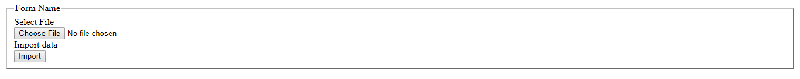
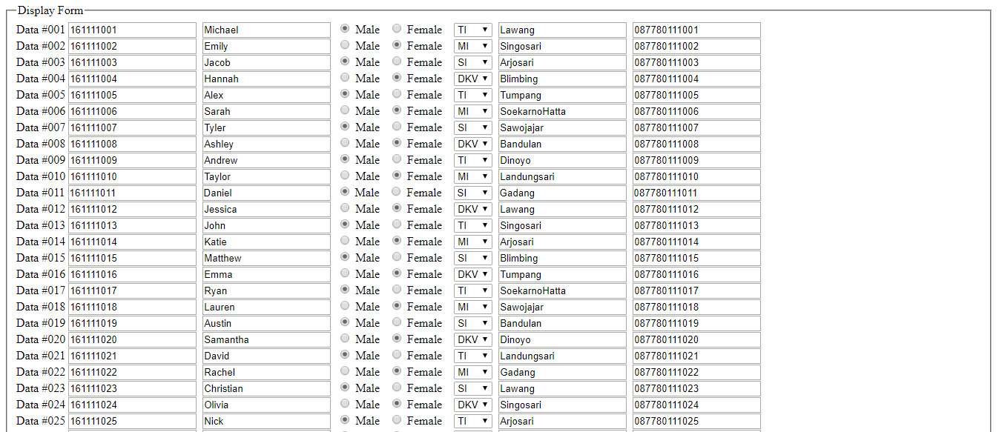
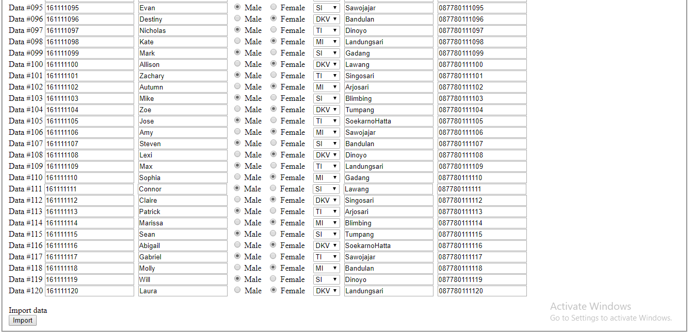

# Import CSV
Import csv to your mysql databse using php application.
you can look the example of the csv file at convertcsv.csv

# Database
the example database of this project is aka.sql

# Screenshot
Index : 

Display :

Import succeed :

Student's list : 
